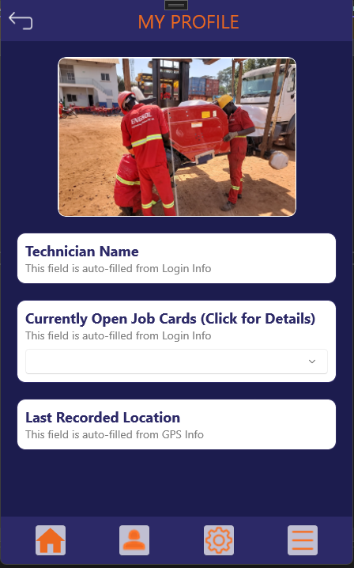
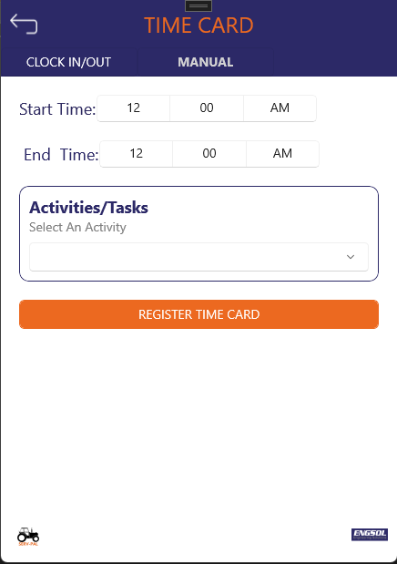

# User Guide

## Introduction

Welcome to the On-Cloc User Guide. This guide will help you navigate and use the On-Cloc mobile application effectively. Oncloc is a system that is used to manage workers and helps track the time spent on a task.

## Login Page

The Login page is the entry point to the On-Cloc mobile application.

### Username and Password Fields

Enter your username and password to access the On-Cloc application.

### Forgot Password Link

If you have forgotten your password, click on this link to reset it.

## Home Screen

The Home screen provides an overview of the application and quick access to various features.

### Feature 1

Description of the first feature on the Home screen.

### Feature 2

Description of the second feature on the Home screen.

## Profile Screen

The Profile screen allows the technician to view and manage their personal information, job cards, and location data.

### Technician Name

This field is auto-filled from the login information, displaying the technician's name.

### Currently Open Job Cards

This field lists all currently open job cards for the technician. Clicking on this field will display detailed information about each job card.

### Last Recorded Location

This field shows the last recorded location of the technician, auto-filled from the GPS information.

## Settings Page

The Settings page allows the user to customize their application preferences and view app information.

### Preferences

Customize your application preferences here.

### App Information

View information about the app, On this page one has the option of contacting the srtvice advisor 

## Splash Screen

The Splash screen is displayed while the app is loading.

## Timecard Screen

The Timecard screen is used to track and manage work hours.

### Entering Time

Enter your work hours here.

### Viewing Timecards

View and manage your past timecards.

## Travel and Lodging

The Travel and Lodging section helps manage travel and accommodation details.

### Entering Travel Details

Enter your travel details here.

### Viewing Lodging Information

View and manage your lodging information.
